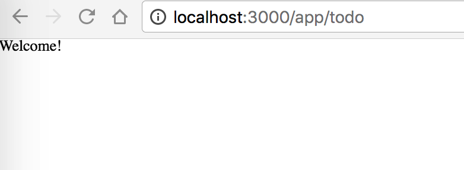

In this toturial, we will create a new module: [TODO]

Before you start this session, make sure you have successfully [setup](./setup.html#Setup-react-application) the react appliation in local machine and can access the appliation through [localhost:3000](http://localhost:3000/app/productList?msg=eyJ0ZW5hbnRDb2RlIjoiR1VFU1QiLCJwcm9kdWNlckNvZGUiOiJhdjEyMzQ1IiwicHJvZHVjZXJOYW1lIjoiQXZyaXN0IEFnZW50IiwicHJvZHVjZXJUeXBlIjoiMSIsInByb2R1Y2VyUGhvbmUiOiIxMjM0NTY3ODkwMSIsInByb2R1Y2VyRW1haWwiOiJhZG1pbkBlYmFvdGVjaC5jb20iLCJleHRyYVByb3BlcnRpZXMiOnt9LCJhZ2VudEluZm9NYXAiOnt9fQ==&sign=14222f754cf86d06cd1f462d8ce91278&tenantCode=GUEST).

## 0. Code Structure (TL;TR)
In routes fold, there are many sub-folds and one **index.js** like this:
```bash
routes/
├── BrowserHistory/
├── Clause/
├── CompanyIntro/
├── DetailDescription/
├── Disease/
├── Home/
├── PersonalPlan/
├── Plan/
├── ProductDetails/
├── ProductList/
├── Quote/
└── index.js
```
Each fold represents a module (set of pages) of the appliation. The **index.js** is entry app. And in each module fold, there are similar contents like below:

```sh
routes/Home/
      ├── assets/                     # images or other statics
      ├── components/                 # react UI components view or page
      │   ├── HomeView.js             # react component
      │   └── HomeView.scss           # according scss
      ├── containers/                 # redux container that connect view and store
      │   └── HomeContainer.js        # container component, '**only** responsible for wiring in the actions and state necessary to render a presentational component'
      ├── index.js                    # dynamic router entry point
      └── modules/                    # redux modues
          ├── actionTypes.js
          ├── actions.js
          └── reducer.js
```
In this turorial, we will create a new fold calls 'Todo' and build a module accordingly.
## 1. Create a new module
   - #### Duplicate from one existing module
     1. Duplicate the **Home** and rename it to **Todo**, and change the according files' naming as below
      ```bash
      Todo/
      ├── components/
      │   ├── TodoView.js
      │   └── TodoView.scss
      ├── containers/
      │   └── TodoContainer.js
      ├── index.js
      └── modules/
          ├── actionTypes.js
          ├── actions.js
          └── reducer.js
      ```
     2. Edit **components/TodoView.js** as below
        - original:
          ```javascript
          import './HomeView.scss'

          export default class HomeView extends React.Component {
          ```
        - new:
          ```javascript
          import './TodoView.scss'

          export default class TodoView extends React.Component {
            ```
     3. Edit **containers/TodoContainer.js** as below
        - original:
          ```js
          import HomeView from '../components/HomeView'
          ```
        - new:
          ```js
          import HomeView from '../components/TodoView'
          ```
   - #### Setup path for this module
     Since this is a new module, you need set a path (for URL) to access this module. We can just edit the **routes/Todo/index.js** in the root of the Todo/ fold.
     ```js
      import { injectReducer } from '../../store/reducers'

      export default (store) => ({
        path: 'todo',
        /*  Async getComponent is only invoked when route matches   */
        getComponent (nextState, cb) {
          /*  Webpack - use 'require.ensure' to create a split point
           and embed an async module loader (jsonp) when bundling   */
          require.ensure([], (require) => {
            /*  Webpack - use require callback to define
             dependencies for bundling   */
            const Todo = require('./containers/TodoContainer').default
            const reducer = require('./modules/reducer').default

            /*  Add the reducer to the store on key 'counter'  */
            injectReducer(store, { key: 'todo', reducer })

            /*  Return getComponent   */
            cb(null, Todo)

            /* Webpack named bundle   */
          }, 'todo')
        }
      })
      ```

    - #### Final step, import Todo into routes
      Edit the **/routes/index.js**, add 2 lines:
      ```js
      ...
      import Todo from './Todo'
      ...

      ...
      Todo(store),
      ...
      ```
     - #### Check result
       Restart npm
       ```bash
       $ npm start
       ```
       Check here [http://localhost:3000/app/todo](http://localhost:3000/app/todo) and if you see this page, 
       configuration, you made it.

## 2. Parameter
## 3. Parameter

## 3. Call restful APIs

## 4. Represent in UI

## 5. Crossing Modules

## 6. i18n

## 7. awesome apple
## 8. liliang zhu
