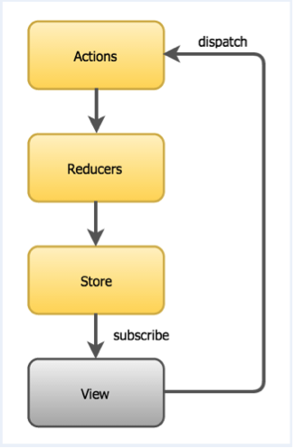
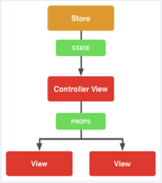

### Redux
In the applicatin, we use [Redux](http://redux.js.org/docs/introduction/) to manage the process and page flow.

Redux is a powerful framework which manages the state in the application, espeically the SPA (single page appliation).

We use Redux in both Action Flow and Data flow.

### Action flow

### Data flow

