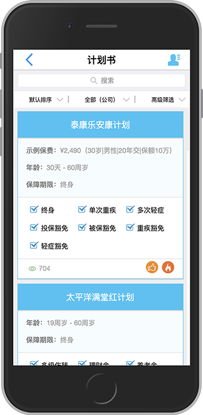

### Setup the out-of-box application by following steps
#### 1. Install npm & Node.js
   - For MS Windows, run below  in CMD:
     ```sh
     $ npm install --global --production windows-build-tools
     ```
   - On Mac

   - Run following commad to check version
     ```sh
     $ node -v
     v6.10.3 //make sure the node version >= 6
     $ npm -v
     5.4.2   //make sure the npm version >= 5
     ```
#### 2. Setup project
   - Setup project runing fold
     ```sh
     $ mkdir ebaocloud-learning
     $ cd ebaocloud-learning
     ```
   - Copy the source code into the fold or run
   - Run below command in the project folder
     ```sh
     $ npm install
     $ npm start
     ```
   - If there is no error in the reuslt, you can open below link in any morden browers: [CLICK HERE](localhost:3000/app/productList?msg=eyJ0ZW5hbnRDb2RlIjoiR1VFU1QiLCJwcm9kdWNlckNvZGUiOiJhdjEyMzQ1IiwicHJvZHVjZXJOYW1lIjoiQXZyaXN0IEFnZW50IiwicHJvZHVjZXJUeXBlIjoiMSIsInByb2R1Y2VyUGhvbmUiOiIxMjM0NTY3ODkwMSIsInByb2R1Y2VyRW1haWwiOiJhZG1pbkBlYmFvdGVjaC5jb20iLCJleHRyYVByb3BlcnRpZXMiOnt9LCJhZ2VudEluZm9NYXAiOnt9fQ==&sign=14222f754cf86d06cd1f462d8ce91278&tenantCode=GUEST). If you see this in your browser (DevTools), then you have made a scusessful installation. 

   -  To build release package
    1. UAT:
    ```sh
    $ npm run build:uat
    ```
    1. Production:
    ```
    $ npm run build
    ```
